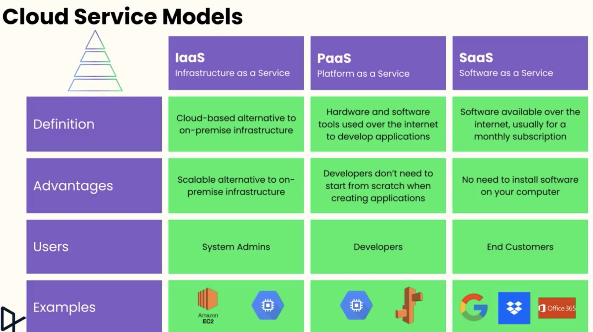

## Introduction to cloud computing

Cloud computing is the delivery of technology services—like computing power, storage, databases, and networking over the internet, with pay-as-you-go
pricing.

## Cloud service models

- IAAS used by system admins
- SAAS used by developers
- PAAS everyone, end users

