# Introduction to cloud computing

Cloud computing is the delivery of technology services—like computing power, storage, databases,applications and networking over the internet, with pay-as-you-go
pricing.

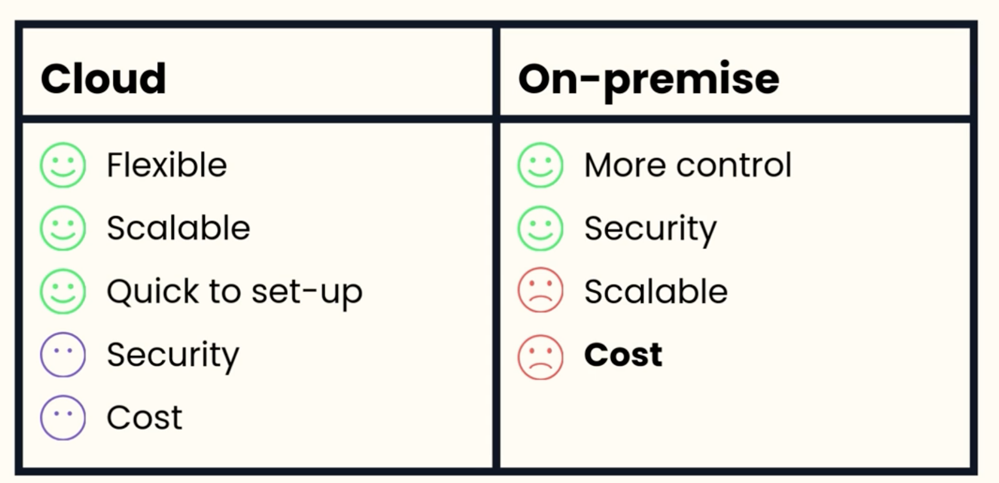

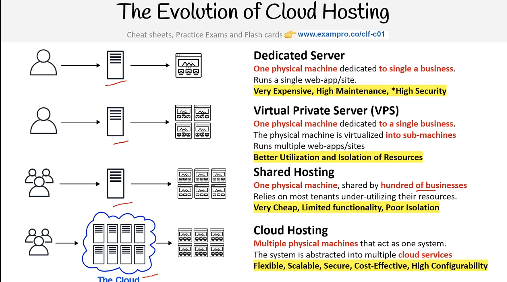

## Cloud service models

- IAAS used by system admins : basic building blocks for cloud information technology, provides networking features, storage sspace. e.g AWS, Azure
- PAAS used by developers: removes need to manage underlying infrastructure, through automation. It allows you to focus on deployment and management. e.g heroku, Google App Engine
- SAAS everyone, end users: provides you with complete product. e.g Gmail, microsoft office

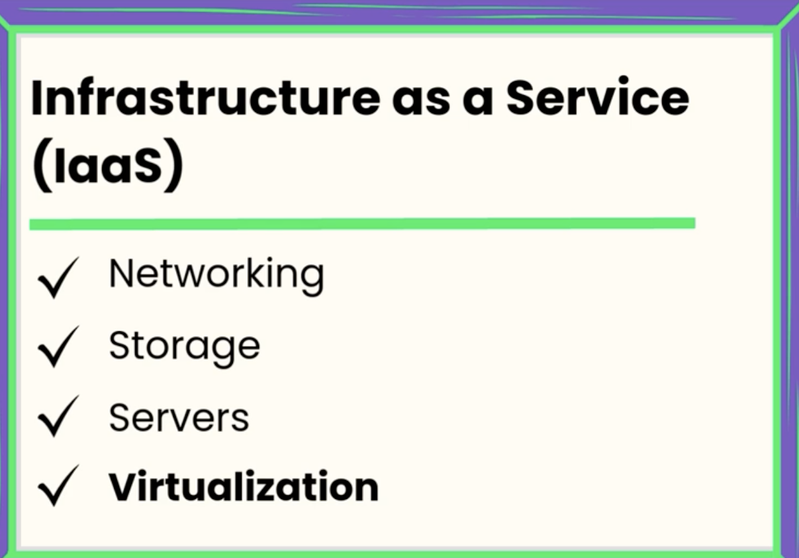
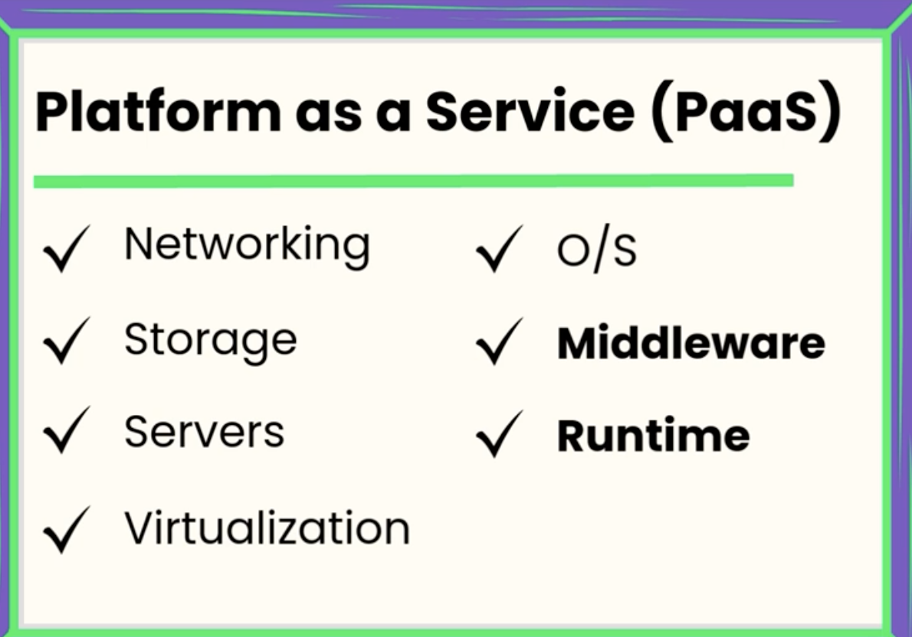
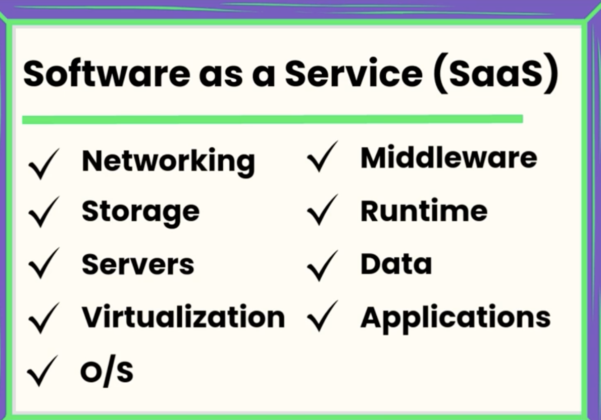

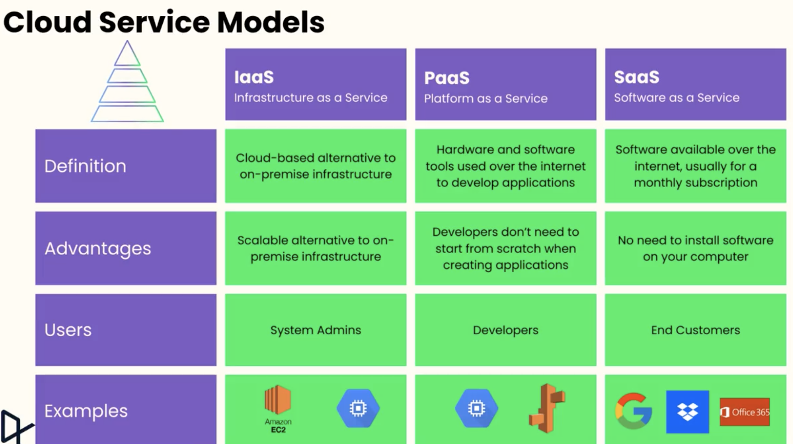

## Cloud computing deployment model

- Public Cloud: Fully deployed in the cloud.Fully utilizing cloud computing. All part of application runs in the cloud. Example: Using Google Drive or deploying an app on Vercel.
- Hybrid: Deployment is in such a way that to connect existing infrastructure and applications to cloud-basedd resources. E.g cloud and existing on-premises resources. Example: A hospital using a private cloud for patient data and public cloud for running its website.
- On premisis ( private cloud): Uses virtualization and resource management tools. Everything built on the company's data center. Example: A bank running its own cloud server.

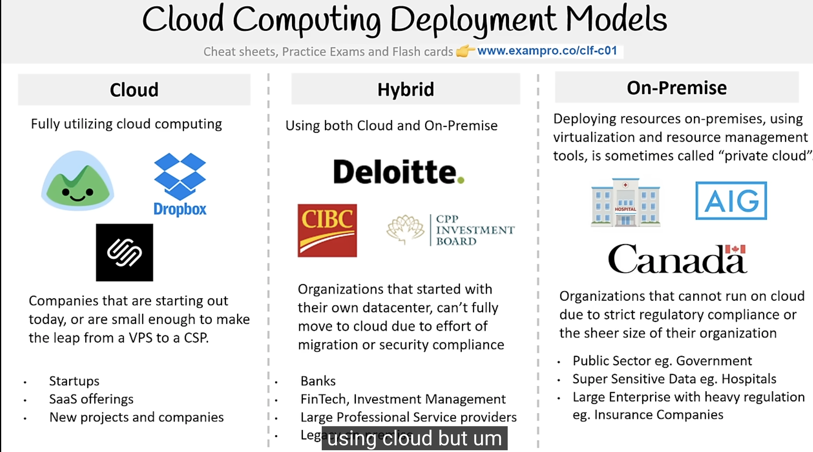

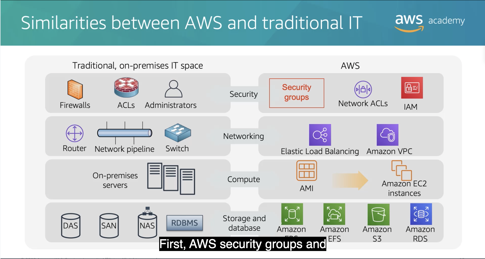

### Advantages of cloud computing

- Trade capital expense for variable expense
- Massive economies of scale
- Stop guessing capacity
- Increase speed and agility
- Stop spending money on running and managing data centers
- Go global in minutes

## Amazon Web Service

- What is a web service?

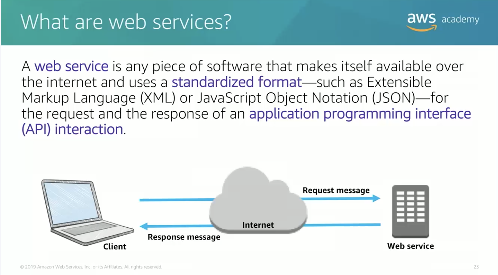

- Amazon web services is a secure cloud platform that offers a broad set of global cloud based product. AWS provides you with on-demandaccessto compute, storage, network, database, and other IT resources and management tools.

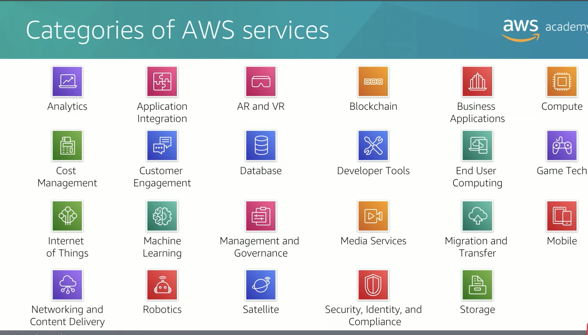

## Some AWS services

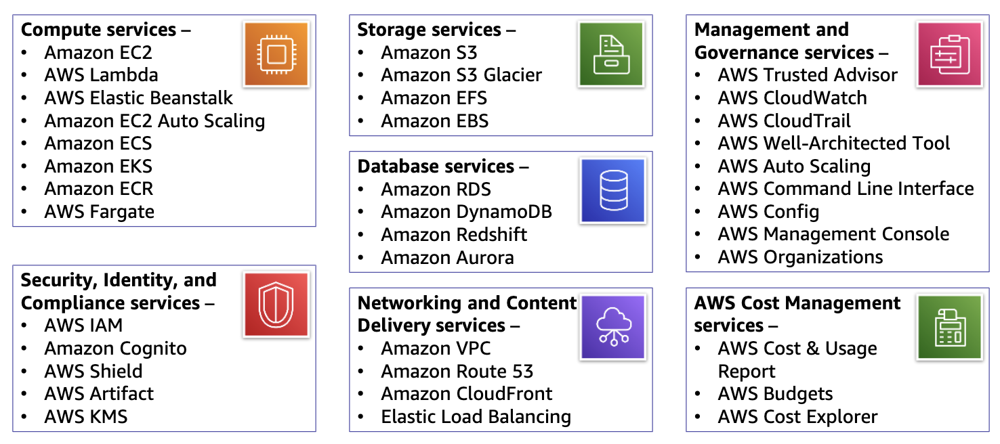

### Some Compute services

- Amazon EC2 - When you need full control over the operating system, specific software configurations, or legacy applications
- AWS Lambda - When you want to run code and not manage or provision servers
- AWS Elastic Beanstalk - Allows you to provision a service that then deploys, manages and scales your web application authomatically for you.
- Amazon Lightsail - For simple web applications, blogs, e-commerce sites, or development environments when you want predictable pricing and simplified management. When you want to launch we application in a straightforward way.
- AWS Batch - For large-scale data processing jobs, scientific computing, or any workload that can be broken into discrete tasks
- AWS Outposts - When you need AWS services in your on-premises data center for latency, data sovereignty, or compliance reasons
- Amazon ECS, EKS, AWS Fargate: for containers or microservice architecture
- VMware Cloud on AWS: When migrating existing on-premiises server to AWS

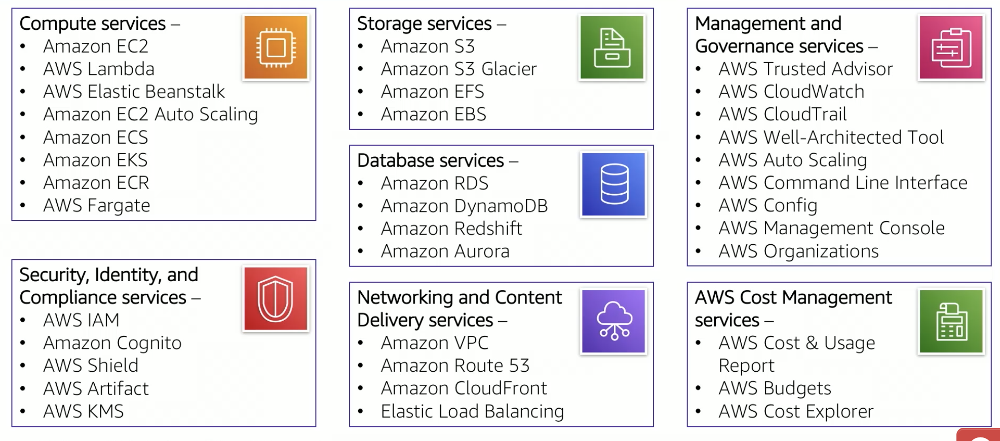

### 3 ways to interract with AWS

- AWS management console
- AWS CLI
- SDKs

## AWS Cloud Adoption Framework (AWS CAF)

AWS CAF is organized into six perspectives. Perspectives consist of sets of capabilities.

- Business
- People
- Governance
- Platform
- Security
- Operation
